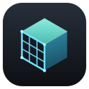

<p align="center">
  
</p>

# rgltf

A native glTF/GLB viewer for Linux that renders [gltfpack](https://github.com/zeux/meshoptimizer)-compressed models correctly.

Native glTF viewers on Linux tend to fall over on gltfpack output — meshopt-compressed buffers come through as garbage, quantized meshes render distorted, and KTX2/Basis textures don't load at all. rgltf exists to render those files the way they're meant to look, on top of ordinary glTF 2.0 PBR.

## What it handles

- **`EXT_meshopt_compression`** — meshopt-decoded vertex/index streams, including the octahedral, quaternion, and exponential filters.
- **`KHR_mesh_quantization`** — integer/normalized attributes dequantized correctly (the common accessor readers assume float and silently don't).
- **`KHR_texture_basisu`** — KTX2 textures transcoded from ETC1S *and* UASTC to BC7, with full mip chains (RGBA8 fallback for non-block-aligned sizes).
- **`KHR_texture_transform`** — UV transforms baked into the mesh.
- **`EXT_mesh_gpu_instancing`** — per-instance transforms drawn in a single call.
- **Animation & skinning** — LINEAR / STEP / CUBICSPLINE channels, GPU-skinned joints, and morph targets.
- **Material extensions** — `KHR_materials_ior` / `specular` / `clearcoat` / `sheen`, plus `transmission` / `volume` via screen-space refraction with roughness blur and Beer–Lambert absorption.
- Standard **metallic-roughness PBR** — base-color / normal / metallic-roughness / occlusion / emissive maps, tangents generated when absent, split-sum **image-based lighting** with a procedural environment and skybox, and ACES tone mapping.

Loads plain `.glb`/`.gltf` too, including PNG/JPEG and base64 `data:` URI textures.

Not yet: alpha *blending* (opaque and alpha-mask only), loadable HDR environments, and `KHR_materials_variants` switching.

## How it's built

rgltf draws into an offscreen wgpu texture that's composited **zero-copy** into a docked viewport inside the [rinch](https://github.com/joeleaver/rinch) GUI framework. rinch owns the window and the GPU device and hands rgltf a shared `Device`/`Queue`.

The renderer is written from scratch instead of reaching for bevy/rend3/renderling, for one concrete reason: the wgpu that rgltf draws with must be the *same crate instance* rinch links, so the texture can be handed over without a copy. rinch pins a patched wgpu fork; a general-purpose renderer brings its own pinned wgpu (and, in some cases, owns the window and event loop), which collides head-on. A small, focused PBR renderer avoids the whole problem.

Three crates:

- `rgltf-render` — the wgpu PBR renderer, with no dependency on rinch.
- `rgltf-asset` — glTF parsing and gltfpack extension decode.
- `rgltf-app` — the rinch UI shell: scene tree, viewport, inspector, orbit camera.

## Installing

**Debian / Ubuntu** — download `rgltf_<version>_amd64.deb` from the releases page and install it:

```sh
sudo apt install ./rgltf_0.1.0-1_amd64.deb
```

It puts `rgltf` on your `PATH`, registers it as a handler for `.glb`/`.gltf` (right-click ▸ *Open With* ▸ *rgltf*), and installs the app icon.

**Other distributions** — download `rgltf-x86_64.AppImage`, make it executable, and run it:

```sh
chmod +x rgltf-x86_64.AppImage
./rgltf-x86_64.AppImage model.glb
```

It relies on the system Vulkan loader (`libvulkan1` / `vulkan-loader`) and your GPU drivers — present on any machine with working 3D — and on the host's C library. An AppImage inherits the glibc version of the machine it was built on, so the release artifacts are built on an old-glibc base for broad compatibility. If you build your own (see below), it requires a glibc at least as new as your build host's.

## Building

```sh
git clone https://github.com/joeleaver/rgltf
cd rgltf
cargo build -p rgltf-app
```

[rinch](https://github.com/joeleaver/rinch) is pulled in as a pinned git dependency, so no extra checkout is needed. To hack on rgltf and rinch together, point the dependency at a local checkout with a patch in the workspace `Cargo.toml`:

```toml
[patch."https://github.com/joeleaver/rinch"]
rinch = { path = "../rinch/crates/rinch" }
```

KTX2/Basis support compiles Khronos [KTX-Software](https://github.com/KhronosGroup/KTX-Software) via cmake, so you'll need a C/C++ toolchain and cmake on `PATH`. The one cmake quirk (a policy-version minimum for the bundled encoder) is handled by `.cargo/config.toml`, so a plain `cargo build` works. A GPU with BC texture support is required — universal on desktop.

To build the distributable packages: `cargo deb -p rgltf-app` produces the `.deb`; `assets/linux/appimage/build-appimage.sh` packages an AppImage from your local build (needs [`appimagetool`](https://github.com/AppImage/appimagetool) on `PATH`); and `assets/linux/appimage/build-portable.sh` produces a broadly-compatible AppImage by compiling in an Ubuntu 20.04 (glibc 2.31) container (needs Docker). Release builds omit the developer MCP debug bridge; enable it during development with `--features debug`.

## Running

```sh
cargo run -p rgltf-app -- path/to/model.glb
```

Or start it with no argument and use **Open glTF…**. Drag to orbit, scroll to zoom.

To produce a gltfpack-compressed file to try it on:

```sh
gltfpack -i model.glb -o model-packed.glb -c -tc      # meshopt + ETC1S KTX2
gltfpack -i model.glb -o model-packed.glb -c -tc -tu  # meshopt + UASTC KTX2
```

Texture compression needs a native gltfpack build with Basis support (the npm build doesn't include it).

## License

Dual-licensed under either [MIT](LICENSE-MIT) or [Apache-2.0](LICENSE-APACHE), at your option.
